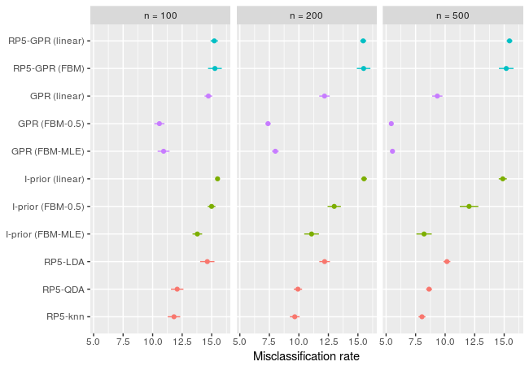
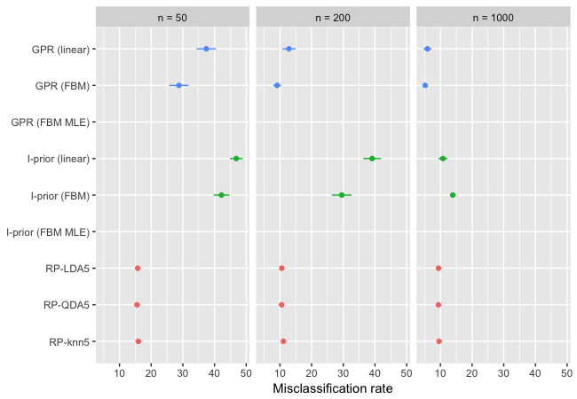

## Introduction

In reference to [1], we compare the peformance of binary classification using Gaussian process regression (GPR) against the method of random projection ensemble classification. GPR estimation algorithms are O(n^3), so it is possible to use the full dimension of the covariates as we are training the models on subsamples of size `n < 1000`. GPR models were fit using the `iprior` package (see [3]). We also sought to determine whether or not random projection ensembles would improve on GPR. The package in [2] provided the random projection matrices. The tables presented below are the misclassification rates (out of 100) along with the standard errors from repeating each experiment 100 times.

## Eye state detection (N = 14,980, p = 14)

|                  |       n = 50|      n = 200|     n = 1000| Rank|
|:-----------------|------------:|------------:|------------:|----:|
|GPR (linear)      | 44.88 (0.68)| 42.67 (1.35)| 37.85 (0.64)|    5|
|GPR (FBM-0.5)     | 43.14 (1.30)| 26.24 (0.64)| 10.69 (0.29)|    1|
|GPR (FBM-MLE)     |           NA|           NA|           NA|    6|
|I-prior (linear)  |           NA|           NA|           NA|    7|
|I-prior (FBM-0.5) |           NA|           NA|           NA|    8|
|I-prior (FBM-MLE) |           NA|           NA|           NA|    9|
|RP-LDA5           | 42.06 (0.38)| 38.61 (0.29)| 36.30 (0.21)|    4|
|RP-QDA5           | 38.97 (0.39)| 32.44 (0.42)| 30.91 (0.87)|    3|
|RP-knn5           | 39.37 (0.39)| 26.91 (0.27)| 13.54 (0.19)|    1|


## Ionosphere data set (N = 350, p = 34)

|                        |       n = 50|      n = 100|      n = 200| Rank|
|:-----------------------|------------:|------------:|------------:|----:|
|RP5-GPR (linear)        | 36.04 (0.11)| 35.90 (0.16)| 35.49 (0.28)|   12|
|RP5-GPR (FBM)           | 36.17 (0.10)| 35.68 (0.16)| 35.80 (0.29)|   13|
|GPR (linear)            | 17.25 (0.30)| 15.64 (0.22)| 13.71 (0.24)|   11|
|GPR (FBM)               | 10.83 (0.27)|  8.18 (0.17)|  6.09 (0.16)|    5|
|GPR (FBM MLE)           | 12.14 (0.32)|  8.60 (0.26)|  6.43 (0.20)|    6|
|I-prior (linear)        | 17.13 (0.37)| 14.96 (0.19)| 13.58 (0.24)|    9|
|I-prior (FBM)           | 10.78 (0.24)|  8.16 (0.19)|  5.95 (0.18)|    3|
|I-prior (FBM MLE)       | 10.46 (0.31)|  7.33 (0.17)|  5.41 (0.16)|    2|
|I-prior probit (linear) | 19.10 (0.55)| 14.78 (0.21)| 13.58 (0.21)|    9|
|I-prior probit (FBM)    | 25.29 (0.47)| 14.18 (0.28)|  6.35 (0.40)|    8|
|RP5-LDA                 | 13.05 (0.38)| 10.75 (0.25)|  9.78 (0.26)|    7|
|RP5-QDA                 |  8.14 (0.37)|  6.15 (0.37)|  5.21 (0.20)|    1|
|RP5-knn                 | 13.05 (0.46)|  7.43 (0.25)|  5.43 (0.19)|    4|


## Down’s syndrome diagnoses in mice (N = 528, p = 77)

*Notes: missing data removed.*

|                        |      n = 100|      n = 200|      n = 500| Rank|
|:-----------------------|------------:|------------:|------------:|----:|
|GPR (linear)            |  6.21 (0.23)|  3.16 (0.12)|  2.19 (0.19)|    5|
|GPR (FBM)               |  8.50 (0.26)|  3.03 (0.15)|  0.25 (0.07)|    2|
|GPR (FBM MLE)           |  4.47 (0.21)|  1.01 (0.11)|  0.00 (0.00)|    1|
|I-prior (linear)        | 17.81 (1.11)|  4.53 (0.18)|  1.96 (0.18)|    6|
|I-prior (FBM)           |  9.11 (0.62)|  3.15 (0.16)|  0.23 (0.07)|    3|
|I-prior (FBM MLE)       |  9.92 (0.62)|  2.35 (0.14)|  0.31 (0.10)|    3|
|I-prior probit (linear) | 22.61 (0.55)| 11.61 (0.23)|  4.04 (0.31)|    7|
|I-prior probit (FBM)    | 23.96 (0.51)| 14.52 (0.30)|  6.21 (0.39)|    9|
|RP-LDA5                 |    NA (  NA)| 25.17 (0.30)| 23.56 (0.26)|   11|
|RP-QDA5                 |    NA (  NA)| 18.24 (0.29)| 16.05 (0.24)|   10|
|RP-knn5                 |    NA (  NA)| 11.24 (0.29)|  2.24 (0.10)|    8|


## Hill–valley identification (N = 1,212, p = 100)

|                  |      n = 100|      n = 200|      n = 500| Rank|
|:-----------------|------------:|------------:|------------:|----:|
|GPR (linear)      | 50.15 (0.14)| 50.02 (0.20)| 48.48 (0.59)|    9|
|GPR (FBM)         | 45.27 (0.09)| 49.78 (0.08)| 50.72 (0.12)|    7|
|GPR (FBM MLE)     | 45.03 (0.09)| 49.73 (0.10)| 50.73 (0.13)|    6|
|I-prior (linear)  | 44.80 (0.21)| 49.20 (0.29)| 50.18 (0.31)|    3|
|I-prior (FBM)     | 45.34 (0.10)| 49.91 (0.08)| 50.69 (0.12)|    8|
|I-prior (FBM MLE) | 45.43 (0.09)| 49.65 (0.10)| 50.68 (0.12)|    5|
|RP-LDA5           | 36.84 (0.84)| 36.45 (0.85)| 32.57 (1.06)|    1|
|RP-QDA5           | 44.43 (0.34)| 43.56 (0.31)| 41.10 (0.33)|    2|
|RP-knn5           | 49.08 (0.24)| 47.27 (0.26)| 36.39 (0.29)|    4|


## Musk identification (N = 6,597, p = 166)

|                  |      n = 100|      n = 200|      n = 500| Rank|
|:-----------------|------------:|------------:|------------:|----:|
|RP5-GPR (linear)  | 15.22 (0.11)| 15.45 (0.09)| 15.45 (0.09)|   10|
|RP5-GPR (FBM)     | 15.28 (0.10)| 15.48 (0.10)| 15.18 (0.11)|   11|
|GPR (linear)      |  2.21 (0.03)|  1.91 (0.04)|  1.44 (0.03)|    4|
|GPR (FBM-0.5)     |  1.64 (0.03)|  1.18 (0.02)|  0.91 (0.01)|    1|
|GPR (FBM-MLE)     |  1.70 (0.04)|  1.23 (0.03)|  0.89 (0.01)|    2|
|I-prior (linear)  |  2.38 (0.02)|  2.42 (0.02)|  2.43 (0.03)|    6|
|I-prior (FBM-0.5) |  2.36 (0.02)|  2.14 (0.04)|  1.91 (0.07)|    5|
|I-prior (FBM-MLE) |  2.06 (0.04)|  1.80 (0.05)|  1.24 (0.04)|    3|
|RP5-LDA           | 14.63 (0.31)| 12.18 (0.23)| 10.15 (0.15)|    9|
|RP5-QDA           | 12.08 (0.27)|  9.92 (0.18)|  8.64 (0.13)|    8|
|RP5-knn           | 11.81 (0.27)|  9.65 (0.21)|  8.04 (0.15)|    7|



## Cardiac arrhythmia data (N = 451, p = 194)

|                        |       n = 50|      n = 100|      n = 200| Rank|
|:-----------------------|------------:|------------:|------------:|----:|
|RP5-GPR (linear)        | 47.31 (0.32)| 47.51 (0.40)| 46.16 (0.33)|   13|
|RP5-GPR (FBM)           | 47.10 (0.33)| 46.74 (0.27)| 46.37 (0.25)|   11|
|GPR (linear)            | 42.20 (0.65)| 33.23 (0.51)| 27.70 (0.34)|    8|
|GPR (FBM)               | 32.75 (0.46)| 27.76 (0.23)| 25.13 (0.24)|    2|
|GPR (FBM MLE)           | 34.07 (0.62)| 28.43 (0.27)| 25.19 (0.22)|    4|
|I-prior (linear)        | 47.63 (0.48)| 46.93 (0.51)| 42.36 (0.48)|   12|
|I-prior (FBM)           | 41.57 (0.72)| 36.64 (0.66)| 32.36 (0.37)|   10|
|I-prior (FBM MLE)       | 36.11 (0.68)| 30.06 (0.40)| 27.48 (0.41)|    7|
|I-prior probit (linear) | 41.88 (0.57)| 35.05 (0.44)| 29.19 (0.28)|    9|
|I-prior probit (FBM)    | 25.29 (0.47)| 14.18 (0.28)|  6.35 (0.40)|    1|
|RP5-LDA                 | 33.24 (0.42)| 30.19 (0.35)| 27.49 (0.30)|    6|
|RP5-QDA                 | 30.47 (0.33)| 28.28 (0.26)| 26.31 (0.28)|    3|
|RP5-knn                 | 33.49 (0.40)| 30.18 (0.33)| 27.09 (0.31)|    5|


## Human activity recognition (N = 2,633, p = 561)

*TBC*

## Handwritten digits (N = 1,500, p = 5000)

*Results are preliminary*

|                  |       n = 50|      n = 200|     n = 1000| Rank|
|:-----------------|------------:|------------:|------------:|----:|
|GPR (linear)      | 37.57 (3.96)| 18.61 (4.68)| 12.95 (5.11)|    7|
|GPR (FBM)         | 20.73 (2.05)| 11.95 (3.64)|  4.85 (0.29)|    4|
|GPR (FBM MLE)     | 14.62 (0.67)|  7.70 (0.54)|  5.25 (0.35)|    1|
|I-prior (linear)  | 49.89 (0.30)| 47.46 (2.56)|  9.38 (1.12)|    8|
|I-prior (FBM)     | 36.67 (4.62)| 26.53 (5.13)| 13.67 (1.00)|    6|
|I-prior (FBM MLE) |           NA|           NA|           NA|    9|
|RP-LDA5           | 15.75 (0.41)| 10.58 (0.17)|  9.39 (0.15)|    3|
|RP-QDA5           | 15.53 (0.40)| 10.53 (0.19)|  9.37 (0.16)|    2|
|RP-knn5           | 15.95 (0.46)| 11.09 (0.17)|  9.57 (0.16)|    5|



## Experiment notes

1. For each data set, a training set of size `n` was formed by subsampling the `N` observations. A GPR model was fitted on this training set, and the test classification rate (out of 100) was calculated on the remaining data (or where applicable, a subsample of size 1000). Each experiment was repeated 100 times.
2. For RP-GPR, the data was projected to a smaller dimension of `d=5`. We were unable to use the default values for `B1` and `B2` as suggested in [1] due to time constraints. We resorted to using `B1 = 30` and `B2 = 5`.
3. For each subsample, the methods are ranked according to the classification error rates (plus the standard error), with the smallest values ranked highest. The `Rank` column in the table represents the "average" rank over the subsamples.
4. Functions to run the 100 repeated experiments for each data set were parallelised over the available number of cores. R can detect the number of cores available through `detectCores()`, but this usually includes hyper-threads. Set the desired number of cores in the R file.
5. Experiments were conducted on the following machine:

```r
> sessionInfo()
## R version 3.3.2 (2016-10-31)
## Platform: x86_64-apple-darwin13.4.0 (64-bit)
## Running under: macOS Sierra 10.12.3
## 
## locale:
## [1] en_GB.UTF-8/en_GB.UTF-8/en_GB.UTF-8/C/en_GB.UTF-8/en_GB.UTF-8
## 
## attached base packages:
## [1] parallel  stats     graphics  grDevices utils     datasets  methods   base
## 
## other attached packages:
##  [1] gridExtra_2.2.1          doSNOW_1.0.14            snow_0.4-2
##  [4] iterators_1.0.8          foreach_1.4.3            ggplot2_2.2.1
##  [7] RPEnsemble_0.3           MASS_7.3-45              distr_2.6
## [10] SweaveListingUtils_0.7.5 sfsmisc_1.1-0            startupmsg_0.9.3
## [13] iprior_0.6.4.9002
## 
## loaded via a namespace (and not attached):
##  [1] Rcpp_0.12.9        knitr_1.15.1       magrittr_1.5       munsell_0.4.3
##  [5] colorspace_1.3-2   R6_2.2.0           httr_1.2.1         stringr_1.2.0
##  [9] plyr_1.8.4         tools_3.3.2        grid_3.3.2         gtable_0.2.0
## [13] class_7.3-14       lazyeval_0.2.0     assertthat_0.1     tibble_1.2
## [17] RColorBrewer_1.1-2 reshape2_1.4.2     codetools_0.2-15   curl_2.3
## [21] stringi_1.1.2      compiler_3.3.2     pushoverr_1.0.0    scales_0.4.1
## [25] jsonlite_1.3
```

[1] Cannings, T. I. and Samworth, R. J. (2017). Random projection ensemble classification. *J. Roy. Statist. Soc., Ser. B (with discussion)*, to appear.

[2] Cannings, T. I. and Samworth, R. J. (2016). RPEnsemble: Random projection ensemble classification. R package, version 0.3. https://cran.r-project.org/web/packages/RPEnsemble/index.html

[3] Jamil, H. (2017). iprior: Linear Regression using I-Priors. R package version
0.6.4.9002. https://github.com/haziqjamil/iprior.
