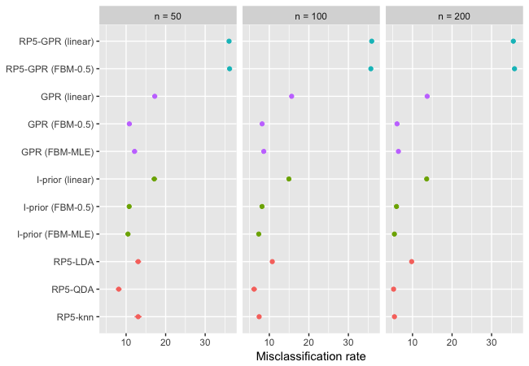
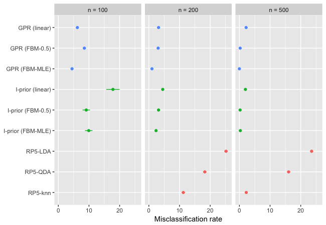

# Ionosphere data (N = 350, p = 34)

|                        |       n = 50|      n = 100|      n = 200| Rank|
|:-----------------------|------------:|------------:|------------:|----:|
|GPR (linear)            | 17.16 (0.27)| 15.28 (0.22)| 13.40 (0.20)|    8|
|GPR (FBM)               | 10.94 (0.28)|  8.23 (0.19)|  6.51 (0.19)|    4|
|GPR (FBM MLE)           | 12.66 (0.38)|  8.89 (0.22)|  6.29 (0.20)|    4|
|I-prior (linear)        | 17.28 (0.31)| 14.94 (0.19)| 13.49 (0.20)|   10|
|I-prior (FBM)           | 10.73 (0.30)|  7.90 (0.17)|  6.37 (0.19)|    2|
|I-prior (FBM MLE)       | 11.25 (0.38)|  7.39 (0.22)|  5.75 (0.17)|    2|
|I-prior probit (linear) | 20.18 (0.56)| 14.62 (0.18)| 13.47 (0.23)|    9|
|I-prior probit (FBM)    | 16.71 (0.46)| 10.03 (0.23)|  7.25 (0.20)|    6|
|RP-LDA5                 | 13.05 (0.38)| 10.75 (0.25)|  9.78 (0.26)|    6|
|RP-QDA5                 |  8.14 (0.37)|  6.15 (0.37)|  5.21 (0.20)|    1|
|RP-knn5                 | 13.05 (0.46)|  7.43 (0.25)|  5.43 (0.19)|    3|

# Mice protein expressions (N = 528, p = 77)

*Notes: missing data removed.*

|                        |      n = 100|      n = 200|      n = 500| Rank|
|:-----------------------|------------:|------------:|------------:|----:|
|GPR (linear)            |  6.14 (0.20)|  3.11 (0.10)|  1.87 (0.18)|    3|
|GPR (FBM)               |  8.15 (0.22)|  2.89 (0.16)|  0.44 (0.10)|    2|
|GPR (FBM MLE)           |  4.32 (0.19)|  1.09 (0.11)|  0.00 (0.00)|    1|
|I-prior (linear)        | 19.13 (1.10)|  4.65 (0.18)|  2.17 (0.19)|    5|
|I-prior (FBM)           |  9.79 (0.60)|  3.22 (0.17)|  0.40 (0.10)|    4|
|I-prior (FBM MLE)       |  9.82 (0.46)|  2.16 (0.13)|  0.21 (0.07)|    2|
|I-prior probit (linear) | 21.69 (0.46)| 11.05 (0.25)|  3.56 (0.26)|    6|
|I-prior probit (FBM)    | 25.29 (0.47)| 14.18 (0.28)|  6.35 (0.40)|    8|
|RP-LDA5                 |    NA (  NA)| 25.17 (0.30)| 23.56 (0.26)|   10|
|RP-QDA5                 |    NA (  NA)| 18.24 (0.29)| 16.05 (0.24)|    9|
|RP-knn5                 |    NA (  NA)| 11.24 (0.29)|  2.24 (0.10)|    7|

# Cardiac arrhythmia data (N = 451, p = 194)

|                  |       n = 50|      n = 100|      n = 200| Rank|
|:-----------------|------------:|------------:|------------:|----:|
|GPR (linear)      | 43.26 (0.69)| 35.05 (0.63)| 27.43 (0.30)|    7|
|GPR (FBM)         | 32.47 (0.43)| 28.07 (0.23)| 25.29 (0.22)|    1|
|GPR (FBM MLE)     | 32.07 (0.43)| 28.15 (0.25)| 25.35 (0.23)|    2|
|I-prior (linear)  | 47.38 (0.52)| 46.89 (0.47)| 42.17 (0.48)|    9|
|I-prior (FBM)     | 42.99 (0.76)| 35.76 (0.62)| 32.51 (0.49)|    8|
|I-prior (FBM MLE) | 35.08 (0.65)| 30.41 (0.39)| 26.71 (0.34)|    5|
|RP-LDA5           | 33.24 (0.42)| 30.19 (0.35)| 27.49 (0.30)|    5|
|RP-QDA5           | 30.47 (0.33)| 28.28 (0.26)| 26.31 (0.28)|    3|
|RP-knn5           | 33.49 (0.40)| 30.18 (0.33)| 27.09 (0.31)|    4|

# Musk data (N = 6597, p = 166)

|                  |      n = 100|      n = 200|      n = 500| Rank|
|:-----------------|------------:|------------:|------------:|----:|
|GPR (linear)      |  2.21 (0.03)|  1.91 (0.04)|  1.44 (0.03)|    4|
|GPR (FBM)         |  1.64 (0.03)|  1.18 (0.02)|  0.91 (0.01)|    1|
|GPR (FBM MLE)     |  1.70 (0.04)|  1.23 (0.03)|  0.89 (0.01)|    2|
|I-prior (linear)  |  2.38 (0.02)|  2.42 (0.02)|  2.43 (0.03)|    6|
|I-prior (FBM)     |  2.36 (0.02)|  2.14 (0.04)|  1.91 (0.07)|    5|
|I-prior (FBM MLE) |  2.06 (0.04)|  1.70 (0.04)|  1.28 (0.04)|    3|
|RP-LDA5           | 14.63 (0.31)| 12.18 (0.23)| 10.15 (0.15)|    9|
|RP-QDA5           | 12.08 (0.27)|  9.92 (0.18)|  8.64 (0.13)|    8|
|RP-knn5           | 11.81 (0.27)|  9.65 (0.21)|  8.04 (0.15)|    7|

# Hill-valley data (N = 1212, p = 100)

|                  |      n = 100|      n = 200|      n = 500| Rank|
|:-----------------|------------:|------------:|------------:|----:|
|GPR (linear)      | 50.15 (0.14)| 50.02 (0.20)| 48.48 (0.59)|    9|
|GPR (FBM)         | 45.27 (0.09)| 49.78 (0.08)| 50.72 (0.12)|    7|
|GPR (FBM MLE)     | 45.03 (0.09)| 49.73 (0.10)| 50.73 (0.13)|    6|
|I-prior (linear)  | 44.80 (0.21)| 49.20 (0.29)| 50.18 (0.31)|    3|
|I-prior (FBM)     | 45.34 (0.10)| 49.91 (0.08)| 50.69 (0.12)|    8|
|I-prior (FBM MLE) | 45.43 (0.09)| 49.65 (0.10)| 50.68 (0.12)|    5|
|RP-LDA5           | 36.84 (0.84)| 36.45 (0.85)| 32.57 (1.06)|    1|
|RP-QDA5           | 44.43 (0.34)| 43.56 (0.31)| 41.10 (0.33)|    2|
|RP-knn5           | 49.08 (0.24)| 47.27 (0.26)| 36.39 (0.29)|    4|

